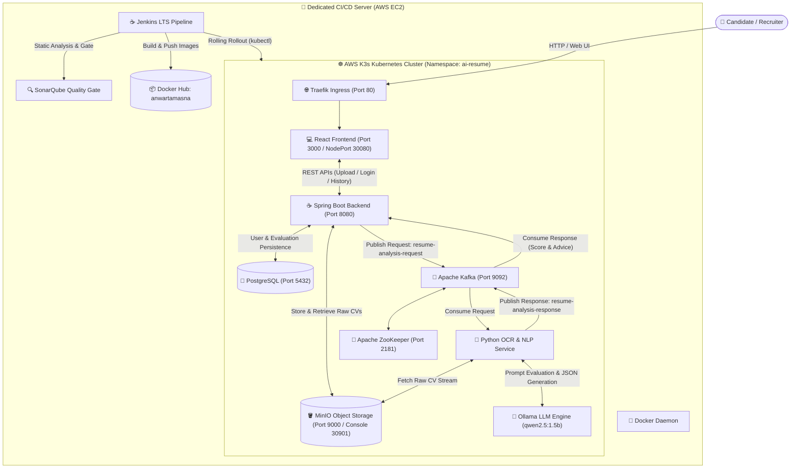
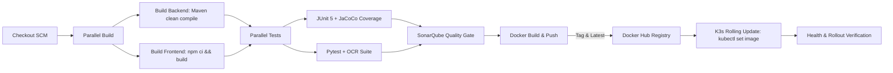

# 🤖 AI Resume Compatibility Analyzer (Cloud-Native K3s & CI/CD)

[](https://k3s.io/)
[](https://aws.amazon.com/)
[](https://www.jenkins.io/)
[](https://www.sonarqube.org/)
[](https://hub.docker.com/)
[-green.svg?logo=springboot)](https://spring.io/projects/spring-boot)
[](https://react.dev/)
[](https://ollama.com/)

A cloud-native, microservices-based ATS (Applicant Tracking System) platform that analyzes resumes against job descriptions using localized Large Language Models (LLMs) and Optical Character Recognition (OCR). Originally developed at **ENSIAS**, now containerized and orchestrated on an **AWS 3-node K3s Kubernetes cluster** with full GitOps CI/CD automation.

---

## 🏗️ System Architecture



---

## 🚀 Key Features

- **Local LLM Evaluation:** Self-hosted `qwen2.5:1.5b` model via Ollama running in-cluster on CPU; no third-party API dependencies or data privacy concerns.
- **High-Performance Inference:** Fine-tuned prompt engineering and token budgets (`num_predict: 400`) deliver comprehensive ATS evaluation in **~30 seconds** on CPU.
- **Multi-Format OCR:** Robust text extraction from image-based and digital PDFs, scans, and documents using **PyMuPDF (`fitz`)** and **Tesseract OCR**.
- **Event-Driven Microservices:** Asynchronous, decoupled communication via **Apache Kafka** ensures HTTP thread scalability and resilience under load.
- **Secure File Lifecycle:** Secure resume uploads and presigned object retrieval backed by **MinIO S3-compatible Object Storage**.
- **Automated CI/CD Pipeline:** Fully automated testing (JUnit + Pytest), SonarQube code scanning, Docker Hub image deployment, and zero-downtime rolling updates.

---

## 📦 Microservices Breakdown

| Service | Technology | Description | Kubernetes Resource |
| :--- | :--- | :--- | :--- |
| **`app-frontend`** | React 18, Vite, Tailwind CSS | Web dashboard for uploading resumes, job descriptions, and viewing interactive compatibility breakdowns. | Deployment (1 rep), Service (NodePort 30080) |
| **`app-backend`** | Java 21, Spring Boot 3.5, Spring Security, JWT | Handles authentication, MinIO uploads, database transactions, and coordinates async Kafka requests. | Deployment (1 rep), ClusterIP |
| **`ocr-service`** | Python 3.9, PyMuPDF, Tesseract, Kafka-Python | Consumes Kafka messages, parses PDF/image byte streams, and invokes the LLM with structured prompts. | Deployment (1 rep), ClusterIP |
| **`ollama`** | Alpine Ollama, `qwen2.5:1.5b` | Self-contained inference engine with persistent model volume cache. | Deployment (1 rep), ClusterIP, PVC |
| **`kafka` & `zookeeper`** | Confluent Kafka 7.5 | Manages topics (`resume-analysis-request`, `resume-analysis-response`). | Deployments, ClusterIP Services |
| **`minio`** | Chainguard MinIO | Object store bucket `resumes` for uploaded candidate documents. | Deployment, NodePort (Console: 30901) |
| **`postgres`** | PostgreSQL 16 Alpine | Stores user accounts, authentication tokens, and analysis histories. | Deployment, ClusterIP, PVC |

---

## ☸️ Kubernetes Manifests (`k8s/`)

The application deployment is structured in declarative YAML manifests located in `k8s/`:

```text
k8s/
├── 00-namespace.yaml          # Defines isolated 'ai-resume' namespace
├── 01-config-secrets.yaml     # ConfigMaps and Secrets (DB, MinIO, Kafka, JWT, Ollama)
├── 02-storage.yaml            # PersistentVolumeClaims (local-path provisioner)
├── 03-postgres.yaml           # PostgreSQL deployment, service & volume
├── 04-minio.yaml              # MinIO deployment, API & Console services
├── 05-kafka-zookeeper.yaml    # ZooKeeper and Kafka single-node broker
├── 06-ollama.yaml             # Ollama LLM server deployment and storage
├── 07-backend.yaml            # Spring Boot REST API deployment & service
├── 08-ocr-service.yaml        # Python OCR & Kafka consumer deployment
├── 09-frontend.yaml           # React/Vite web application deployment & NodePort service
└── 10-ingress.yaml            # Traefik Ingress routing for root HTTP access
```

### Manual Deployment via `kubectl`
```bash
# 1. Apply base infrastructure
kubectl apply -f k8s/00-namespace.yaml
kubectl apply -f k8s/01-config-secrets.yaml
kubectl apply -f k8s/02-storage.yaml
kubectl apply -f k8s/03-postgres.yaml
kubectl apply -f k8s/04-minio.yaml
kubectl apply -f k8s/05-kafka-zookeeper.yaml
kubectl apply -f k8s/06-ollama.yaml

# 2. Deploy application microservices
kubectl apply -f k8s/07-backend.yaml
kubectl apply -f k8s/08-ocr-service.yaml
kubectl apply -f k8s/09-frontend.yaml
kubectl apply -f k8s/10-ingress.yaml

# 3. Check rollout status
kubectl get pods -n ai-resume -o wide
```

Or execute the included helper script:
```bash
chmod +x deploy-k3s.sh
./deploy-k3s.sh
```

---

## 🔄 Automated CI/CD Pipeline (`Jenkinsfile`)

The pipeline runs automatically on Jenkins upon code commits to `main`:



### Key Stages:
1. **Parallel Compilation:** Java Maven package and React Vite production bundling execute concurrently.
2. **Parallel Testing:**
   - **Backend:** JUnit 5 integration tests verify controllers, security filters, and Kafka producer/consumer flows.
   - **OCR Service:** Pytest suite validates PyMuPDF byte decoding, MinIO parsing, and Ollama JSON extraction.
3. **SonarQube Analysis:** Scans code reliability, security vulnerabilities, and code smells.
4. **Multi-Arch Docker Images:** Container images built and published to Docker Hub (`anwartamasna/ai-resume-backend`, `anwartamasna/ai-resume-ocr`, `anwartamasna/ai-resume-frontend`).
5. **Zero-Downtime K3s Rollout:** Automated rolling updates via `kubectl set image` with health checks.

---

## 🌐 Endpoints & Web Access

Assuming K3s Control Plane IP is `16.16.110.5` and CI/CD Server IP is `16.16.104.165`:

| Service | Port / Protocol | URL | Credentials |
| :--- | :--- | :--- | :--- |
| **Frontend Web UI** | `80` (Traefik Ingress) | `http://16.16.110.5/` | User Account |
| **Frontend Direct** | `30080` (NodePort) | `http://16.16.110.5:30080/` | User Account |
| **MinIO Console** | `30901` (NodePort) | `http://16.16.110.5:30901/` | `minioadmin` / `minioadmin` |
| **Jenkins Dashboard** | `8080` (CI/CD EC2) | `http://16.16.104.165:8080/` | Configured Admin |
| **SonarQube Dashboard** | `9000` (CI/CD EC2) | `http://16.16.104.165:9000/` | Configured Admin |

---

## 🧪 Local Development (Docker Compose)

For local testing without Kubernetes:

```bash
# Clone the repository
git clone https://github.com/Anwartamasna/AI_Analyser.git
cd AI_Analyser

# Build and start all services
docker-compose up -d --build

# Follow logs of the AI model download
docker logs -f resume_ollama
```

---

## 📊 Sample ATS Output JSON

```json
{
  "is_suitable": true,
  "suitability_score": 85,
  "experience_level": "Senior",
  "matched_skills": ["Kubernetes", "AWS", "Terraform", "CI/CD", "GitOps", "Docker"],
  "missing_skills": ["Go", "Cloud Security / HashiCorp Vault"],
  "strengths": [
    "Extensive hands-on experience designing and operating Kubernetes clusters.",
    "Strong Infrastructure as Code proficiency with Terraform and Ansible."
  ],
  "recommendations": [
    "• Highlight production cluster metrics and scale (node counts, traffic volumes).",
    "• Emphasize cloud security practices such as secret management and least-privilege IAM."
  ],
  "ats_keywords": ["Kubernetes", "GitOps", "Terraform", "CI/CD", "AWS"],
  "interview_tips": "Focus on real-world incident management and high-availability architecture decisions."
}
```

---

## 👨‍💻 Author & Acknowledgements

- **Developed by:** Anwar Tamasna
- **Academic Origin:** Project developed during engineering studies at **ENSIAS** (École Nationale Supérieure d'Informatique et d'Analyse des Systèmes).
- **Specialization:** Cloud Engineering, DevOps, Infrastructure as Code, and Applied AI.
